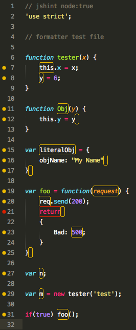

::: page-description
RDK Development Environment
===========================
:::

## Prerequisites
The following programs should be installed.
 * **git**, for versioning, receiving, and contributing source code
 * **node**, for running the resource server and other RDK-related tasks
 * **npm**, which comes with node, for installing library dependencies and programs used for running the resource server
 * **gradle**, for running acceptance tests
 * **ruby**, for running acceptance tests
 * **bundler**, for installing acceptance test dependencies

*Project team members should run the workspace setup script provided by devops instead of manually installing anything*

## Source Code
Clone the RDK repository and check out the dev branch to see the current development files. Do not commit to the master branch.

## IDE
The project's standard text editor is Sublime Text 3, with the following plugins:
 * JsFormat
 * SublimeLinter
 * SublimeLinter-jshint
 * EditorConfig
 * Javascript Refactor
 * TrailingSpaces
 * SidebarEnhancements
 * GitGutter

Install these plugins through the Sublime [Package Control](https://packagecontrol.io/installation) plugin.

### Syntax Highlighter Check
To verify that you have properly configured JSHint in Sublime:
 * **Save** the following code to a temporary new file  
   called **badFormat.js**  
   inside the **/product/production/rdk** directory of the rdk repository
 * Open badFormat.js in Sublime Text
 * Compare the warnings to the reference image below <table style="table-layout: fixed; width: 100%;"><tr><td>
   ```JavaScript
   // jshint node:true
   'use strict';
   
   // formatter test file
    
   function tester(x) {
       this.x = x;
       y = 6;
   }
   
   function Obj(y) {
       this.y = y
   }
   
   var literalObj = {
       objName: "My Name"
   }
   
   var foo = function(request) {
       req.send(200);
       return
       {
           Bad: 500;
       }
   }
   
   var n;
   
   var m = new tester('test');
   
   if(true) foo();
   ```
   </td><td style="text-align: center; vertical-align: middle;">
   
   
   
   </td></tr></table>


## Debugging
The Node-Inspector npm package allows debugging node.js programs from a Chrome tab.


<br />
---
Next: [Style Guide](style-guide.md)
